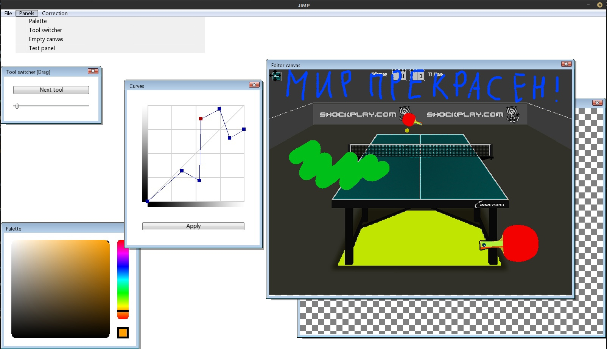

### JIMP - Jules Image Manipulation Program



## What is that?
JIMP is very simple (and yet useless) graphics editor - you even can`t save somthing now :( 
But it already has canvases, palette, layers, curves and four tools - brush, eraser, fill and drag.

## How to use?
When you open the app, you see three panels - canvas panel, palette panel and tool switcher. You can drag them, but cannot resize.

To apply tool to the image, just click on the canvas and begin to move the mouse. Note that the tool is applied to the current layer!

To switch current layer, use Ctrl+PgUp and Ctrl+PgDown. To switch tools, use PgUp and PgDown or switch button.

To open a BMP file, type ```./jimp "<filepath>"```. Typing ```./jimp``` will open JIMP with an empty canvas.

## How to build?
Enter main JIMP folder, type ```cmake build .``` and then ```make``` in the terminal. Note that the app must run under Linux with installed SFML!
